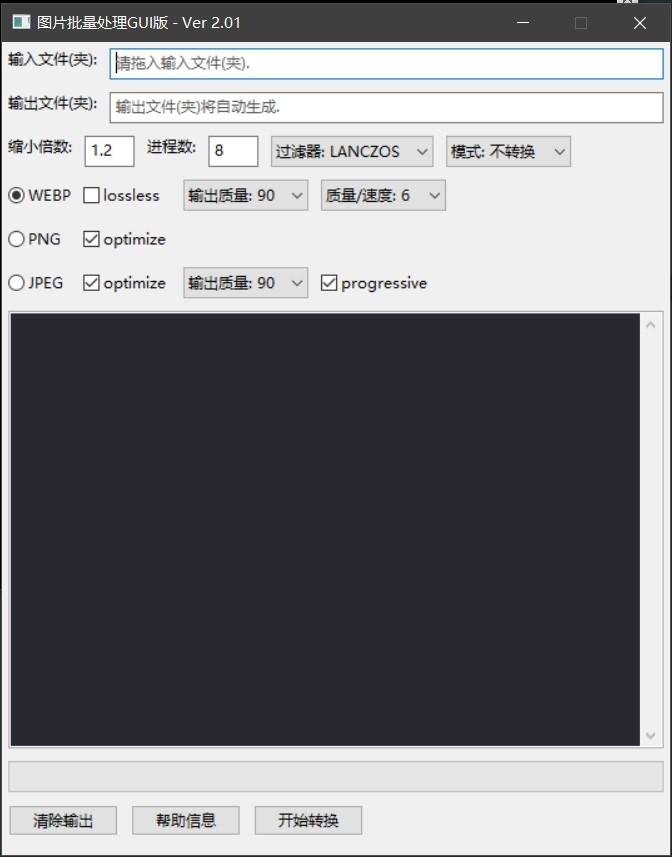

# Picture-batch-converter

[点击此处打开中文版 README](./README.zh-CN.md)

A tool for batch compression, transcoding images. Written in python.

The program can convert image files into ```webp```,  ```jpg``` or ```png``` format individually or in batches. It has a friendly GUI interface to facilitate our operation. It can create multiple processes to process images to maximize CPU potential.

Screenshots:


