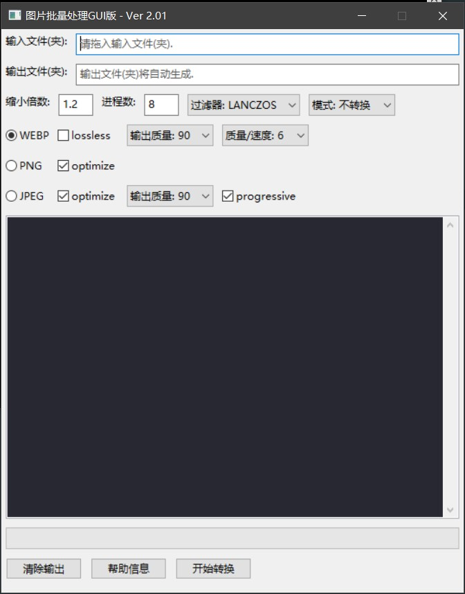

# Picture-batch-converter

[Click here to open the English README](./README.md)

一个批量压缩和转码图片的工具, 使用 Python 编写.

本程序可以将大部分图片文件批量或者单独地转换为 ```webp```, ```jpg``` 或者 ```png``` 格式. 它有一个用户友好, 易于操作的界面. 它可以开启多进程来处理图片, 大幅度利用 CPU 的能力.

程序截图:


